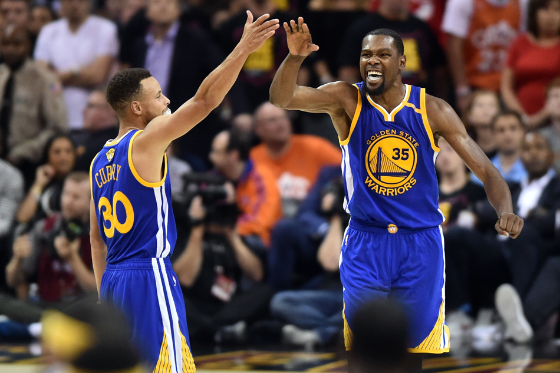
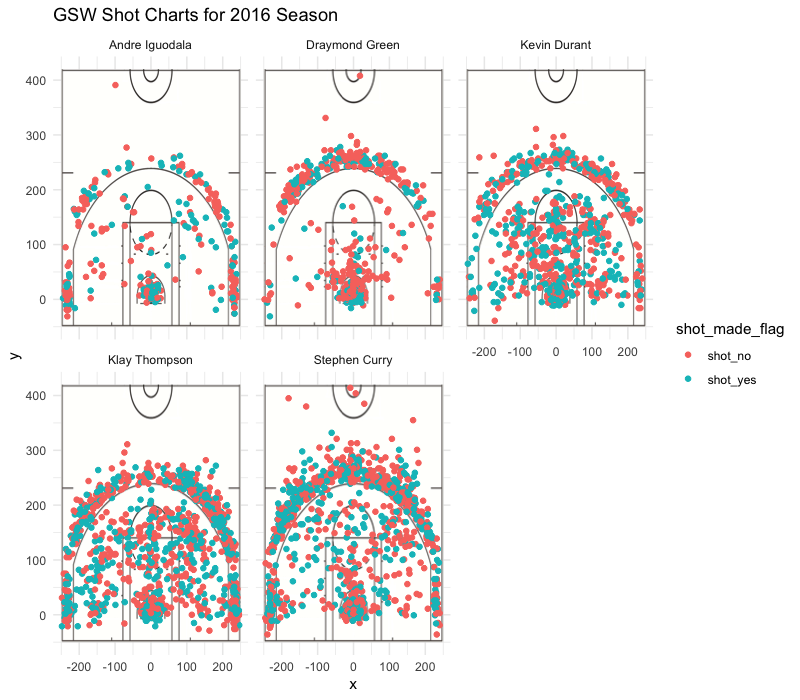
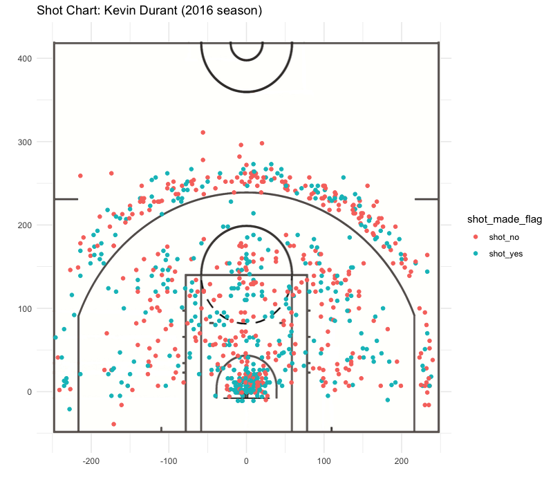

Workout01-lucy-russell
================
Lucy Russell
3/10/2019

GOLDEN STATE WARRIORS--The 2016 Season in Review
------------------------------------------------

##### An analysis of five key GSW players: Stephen Curry, Draymond Green, Andre Iguodala, Kevin Durant, and Klay Thompson.

The 2016-2017 season was marked by an impressive, and even record-breaking, performance by the Bay Area's Golden State Warriors. They dominated the Western conference through-and-through, with a staggering 81.7% win rate, and arose triumphant in the 4-1 finals against the Cleveland Cavaliers.

 *Image of Stephen Curry and Kevin Durant high-fiving during the NBA Finals*

This was also the year that Draymond Green won best defensive player, Andre Iguodala was runner-up for best Sixth Man, and Kevin Durant was runner-up for the MVP title (but did end up taking home the MVP Finals title). Let's take a closer look at the numbers that defined this team's season through an analysis of the following players:

-   Draymond Green
-   Andre Iguodala
-   Stephen Curry
-   Kevin Durant
-   Klay Thompson

There were some shocking statistics that came out of this year's games: anything from a relatively *low* shot percentage by King Curry, to the team's bright new start: Kevin Durant. It was his first season with Golden State Warriors, so we'll be paying special attention to his court action.

#### *Effective 2PT-Shooting Percentages*

    ##   X           Name Total Made Percent_Made
    ## 1 1 Andre Iguodala   210  134     63.80952
    ## 2 2   Kevin Durant   643  390     60.65319
    ## 3 3  Stephen Curry   563  304     53.99645
    ## 4 4  Klay Thompson   640  329     51.40625
    ## 5 5 Draymond Green   346  171     49.42197

*The table shows the five players, ranked by 2-pt effective shooting percentage*

#### *Effective 3PT-Shooting Percentages*

    ##   X           Name Total Made Percent_Made
    ## 1 1  Klay Thompson   580  246     42.41379
    ## 2 2  Stephen Curry   687  280     40.75691
    ## 3 3   Kevin Durant   272  105     38.60294
    ## 4 4 Andre Iguodala   161   58     36.02484
    ## 5 5 Draymond Green   232   74     31.89655

*The table shows the five players, ranked by 3-pt effective shooting percentage*

#### *Overall Effective Shooting Percentages*

    ##   X           Name Total Made Percent_Made
    ## 1 1   Kevin Durant   915  495     54.09836
    ## 2 2 Andre Iguodala   371  192     51.75202
    ## 3 3  Klay Thompson  1220  575     47.13115
    ## 4 4  Stephen Curry  1250  584     46.72000
    ## 5 5 Draymond Green   578  245     42.38754

*The table shows the five players, ranked by overall (2-pt and 3-pt) effective shooting percentage*

These figures may initially appear somewhat off for anyone who has ever seen the Warriors play--Stephen Curry is renowned in the basketball world as a marksman. So why is Kevin Durant on top for the overall shooting percentage? Why is Stephen Curry ranked *so* relatively low? How does everyone else figure into these figures and the team?

#### The answer to these questions may come from the following shot charts:

 *The graphic shows the shot chart for each of the five players in the 2016 season*

As you can see in the GSW Shot Charts for this past season, players are taking vastly different shots, based on their positions and pasts as players.

Let's start by looking at Stephen Curry: he is notorious for his 3-pointers, and thus is often passed the ball in the three point zone. He has far more difficult shots than many of the other players, because of his performance in that area. Curry is often the player that is implicitly asked to take shots from the farthest reaches of the court, or in the most intense parts of the game. Ironically, because he is known as a sharpshooter, this most likely accounts for his lowered effective shot percentage.

On the other hand, Andre Iguodala is a very strong defensive player, so he's not really supposed to be the one scoring. His stats likely appear so high, because he's only passed to ball to shoot when he's either *very* close, or in an ideal shooting position. These conditions are favorable to a high scoring percentage. Looking at the shot chart, it's clear that he's taking the fewest shots, and they're most of them are directly below the net.

One more slightly surprising statistic is Klay Thompson's performance. He's taken almost as many shots overall as Stephen Curry, but has a higher overall percentage. When you compare their shot charts, it's clear that Stephen Curry's 3-pt title is yet again chipping away at his actual percentage performance. Klay's 3-pointers are mcuh more concentrated on the 3-point line, and thus easier shots to make. He is also shooting significantly more within the 2-point zone.

Those were some of the extremes, showing how percentages can be misleading when trying to figure out where and when players are most effective on the court. However, for the *almost* MVP Kevin Durant, his performance is as consistent on paper as it is on the court. This was a particularly good year for Durant, placing him on top of the overall field goal percentage table. His career field goal make rate is around 49.2%, but this 2016-17 season, he boasted about a 54.1%.

#### Let's take an upclose look at Kevin Durant's shot chart:

 *The graphic shows the shot chart for Kevin Durant in the 2016 season*

KD's shots are constisent: he is making about three-quarters of his shots within the key, about half on both the right and left shoulder, and slightly less than half the shots outside the 3-point line.

**Sources**:

-   [Basketball Reference](https://www.basketball-reference.com/leagues/NBA_2017.html)

-   [Kevin Durant Info](https://www.basketball-reference.com/players/d/duranke01.html)

-   [2016-17 Season Awards](https://en.wikipedia.org/wiki/2016%E2%80%9317_NBA_season#Awards)

-   [KD Curry Image](https://news.abs-cbn.com/sports/06/08/17/warriors-turn-back-cavs-anew-for-3-0-finals-lead)
